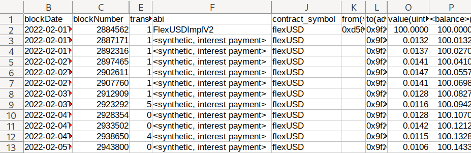

# smartbch-accounting-data



Tool to pull data that is relevant for financial accounting from a smartbch-node

> Caveat: there are know issues and potential problems. Always double-check the output data somehow and be careful. See section `caveats` below.

## Motivation and Overview

Getting data from EVM chains for accounting purposes (in case you want to pay taxes, you probably have this need) isn't a straight-forward streamlined process. This problem is even worse in new projects like smartBCH because many useful tools haven't been ported over from more mature chains like ethereum or are still not complete enough regarding the data they allow to pull from the chain. 

This tool tries to help with this issue by pulling data from a smartbch node and dumping it (after processing) to CSV files.

### Current state: mainly geared to flexUSD interest payments

While the scope of this project is much larger, it is currently heavily geared towards getting a list of flexUSD interest payments.

getting a list of flexUSD interest payments is pretty hard: due to the way the flexUSD contract handles interest payments (using a multiplier approach) there are no separate transactions paying interest to each holder. Instead, a contract-global multiplier is used (and adjusten when interest is paid).

### How this tools extracts data

The general mode of operation of this tool is to use the rpc interface of a smartbch node to call the `queryLogs(...)` function, which will return a list of events emitted by the given contract over it's course of existance. These events are decoded and written to CSV Files (one for each event type)

#### How this tool extracts flexUSD interest payments

For flexUSD contract specifically, there is an event named `ChangeMultiplier`. flexUSD uses a multiplier that is applied to account balances on operations that read or write account balances. That was interest can be paid to all accounts simply by increasing this multiplier. The downside is that there are not separate interest payment transactions to the accounts.

Given an account, this tool chronologically walks through the associated `Transfer` and `ChangeMultiplier` events, tracking the account balance. For each `ChangeMultiplier` event a synthetic event mimiking a `Transfer` event is created (it's named `Transfer`, but abi is `<synthetic, interest payment>`). Those events are mixed with the real `Transfer` events for output to file `Transfer.csv`.

> Caveat: I see a couple of ways this approach could fail. It would probably be better to use `flexUSD.getBalance(<account>)` to arrive at the balance instead of tracking transfers and aggregating the deltas.

## Usage

### Installation

You'll need to install (at least) the following dependencies:
  
  * nodejs
  * npm
  * (please let me know what's missing)

Then run...

```
#> npm install
```

> you might have to restart your terminal/shell to make commands like `npx` available in your $PATH

### Configuration

First copy the example config file and edit it to create your `config.ts`

```
#> cp config.example.ts config.ts
#> edit config.ts
```

main task here is to configure your list of smartbch accounts

### Running

Theres many ways to compile/run a typescript project. One is:

```
#> npx ts-node index.ts 
```

## Telegram group for Support, Feedback, Discussion

for support, feedback and discussion, please use [telegram group smartbch-accounting-data](https://t.me/smartbch_accounting_data)

## Caveats, Issues

 * Everything (including output CSV columns, formats, etc...) is still in flux. Don't depend on things staying the same over time.
 * The general approach used to create flexUSD interest payment events may or may not work well all cases (there are other ideas, but for now it's what it is, see above for a description), please sanity-check the output.
 * CSV date output is not formatted in a good way for office software to understand
 * see [TODO](TODO)

